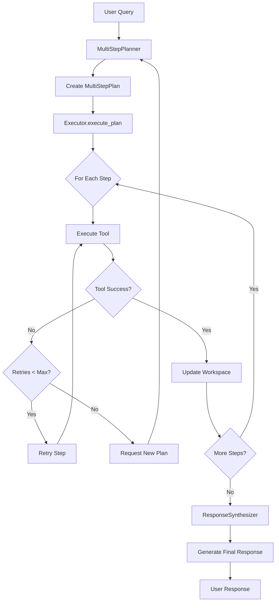
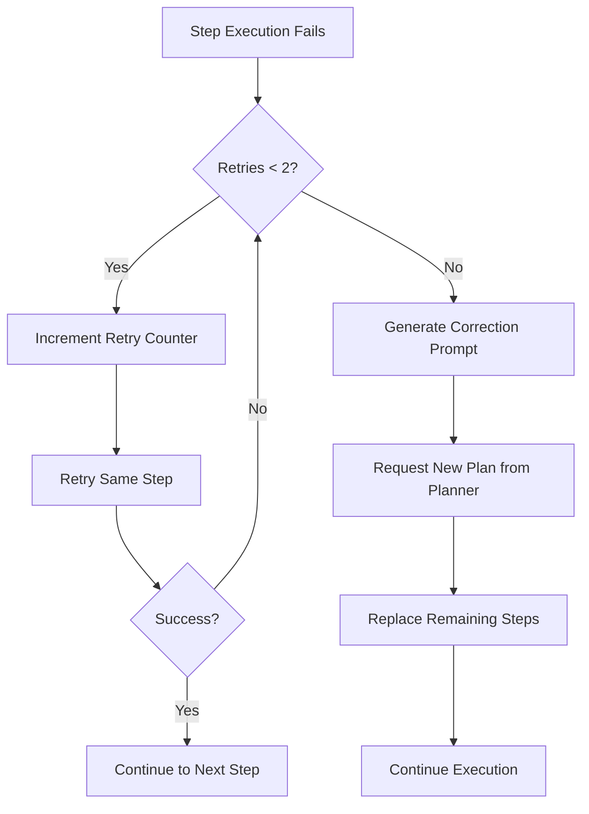

# AgentCP Workflow Architecture Documentation

## Table of Contents
1. [Overview](#overview)
2. [High-Level Architecture](#high-level-architecture)
3. [Core Components](#core-components)
4. [Workflow Visualization](#workflow-visualization)
5. [Tool Ecosystem](#tool-ecosystem)
6. [Data Flow](#data-flow)
7. [Error Handling & Self-Correction](#error-handling--self-correction)
8. [Example Workflows](#example-workflows)
9. [Implementation Details](#implementation-details)

## Overview

AgentCP is a sophisticated multi-step intelligent agent system designed for financial data analysis. It leverages Large Language Models (LLMs) to decompose complex natural language queries into structured, executable plans. The system operates through a coordinated workflow of specialized components that work together to fetch, process, and synthesize financial data.

### Key Capabilities
- **Natural Language Processing**: Understands complex financial queries in plain English
- **Multi-Step Planning**: Decomposes complex tasks into manageable steps
- **Self-Correction**: Automatically retries and corrects failed operations
- **Data Integration**: Combines multiple data sources and performs complex analysis
- **Intelligent Synthesis**: Generates human-readable responses from raw data

## High-Level Architecture

```
┌─────────────────────────────────────────────────────────────────┐
│                        AgentCP System                           │
├─────────────────────────────────────────────────────────────────┤
│  User Interface Layer                                           │
│  ┌─────────────────┐  ┌─────────────────┐                      │
│  │   Flask Web App │  │   CLI Interface │                      │
│  └─────────────────┘  └─────────────────┘                      │
├─────────────────────────────────────────────────────────────────┤
│  Core Agent Components                                          │
│  ┌───────────────┐ ┌──────────────┐ ┌──────────────────────┐   │
│  │MultiStepPlanner│→│   Executor   │→│ResponseSynthesizer   │   │
│  │   (Brain)     │ │   (Doer)     │ │    (Communicator)    │   │
│  └───────────────┘ └──────────────┘ └──────────────────────┘   │
├─────────────────────────────────────────────────────────────────┤
│  Support Components                                             │
│  ┌─────────────────┐  ┌─────────────────┐                      │
│  │ AgentWorkspace  │  │   LLM Client    │                      │
│  │   (Memory)      │  │  (Intelligence) │                      │
│  └─────────────────┘  └─────────────────┘                      │
├─────────────────────────────────────────────────────────────────┤
│  Tool Ecosystem                                                 │
│  ┌──────────────┐ ┌──────────────┐ ┌─────────────────────────┐ │
│  │  Data Fetch  │ │Code Executor │ │  Other Tools            │ │
│  │    Tool      │ │    Tool      │ │(describe_df, inform_user│ │
│  └──────────────┘ └──────────────┘ └─────────────────────────┘ │
├─────────────────────────────────────────────────────────────────┤
│  Data Layer                                                     │
│  ┌─────────────────┐  ┌─────────────────────────────────────┐   │
│  │  Financial APIs │  │      Knowledge Base                 │   │
│  │ (Revenues/      │  │   (Client Data, Business Lines)    │   │
│  │  Balances)      │  └─────────────────────────────────────┘   │
│  └─────────────────┘                                            │
└─────────────────────────────────────────────────────────────────┘
```

## Core Components

### 1. MultiStepPlanner (The Brain)
**Purpose**: Decomposes complex natural language queries into structured, executable plans.

**Key Features**:
- Uses LLM to understand user intent
- Creates detailed step-by-step execution plans
- Validates tool compatibility and parameters
- Handles query complexity through strategic decomposition

**Input**: Natural language query (e.g., "What were the top 3 clients by revenue growth?")
**Output**: Structured `MultiStepPlan` object with sequential steps

**Core Principles**:
- **Simplicity**: Favors multiple simple steps over complex ones
- **Targeted Fetches**: Separate data fetches for different time periods
- **Validation**: Ensures tool parameters are valid before execution

### 2. Executor (The Doer)
**Purpose**: Executes multi-step plans with error handling and self-correction.

**Key Features**:
- Sequential step execution with progress tracking
- Automatic retry mechanism (up to 2 retries per step)
- Dynamic plan correction through planner re-invocation
- Tool orchestration and parameter management

**Workflow**:
1. Iterates through plan steps sequentially
2. Executes each tool with appropriate parameters
3. Handles errors with retry logic
4. Updates workspace with intermediate results
5. Provides execution summaries

### 3. ResponseSynthesizer (The Communicator)
**Purpose**: Transforms technical data into user-friendly natural language responses.

**Key Features**:
- Contextual response generation using LLM
- Format-aware output (tables, numbers, explanations)
- Domain-specific financial language
- Summary-first approach with detailed supporting data

**Input**: User query + Final workspace data
**Output**: Natural language response optimized for user consumption

### 4. AgentWorkspace (The Memory)
**Purpose**: Provides short-term memory for storing intermediate dataframes during execution.

**Key Features**:
- Typed dataframe storage with validation
- Key-value access patterns
- Schema inspection capabilities
- Automatic memory management

## Workflow Visualization

### Primary Execution Flow


### Tool Execution Detail
```
Step Execution Lifecycle:
┌─────────────────────────────────────────────────────────────┐
│ 1. Step Preparation                                         │
│    ├─ Extract tool_name and parameters                      │
│    ├─ Log step summary                                      │
│    └─ Initialize retry counter                              │
├─────────────────────────────────────────────────────────────┤
│ 2. Tool Execution                                          │
│    ├─ data_fetch: Query financial APIs                     │
│    ├─ code_executor: Run Python analysis code              │
│    ├─ describe_dataframe: Inspect data schemas             │
│    ├─ get_valid_business_lines: Retrieve metadata          │
│    └─ inform_user: Send direct messages                    │
├─────────────────────────────────────────────────────────────┤
│ 3. Result Processing                                        │
│    ├─ Success: Update workspace, move to next step         │
│    ├─ Failure: Increment retry counter                     │
│    └─ Max retries reached: Request plan correction         │
└─────────────────────────────────────────────────────────────┘
```

## Tool Ecosystem

### Core Tools

#### 1. `data_fetch` Tool
**Purpose**: Retrieves financial data from APIs
**Parameters**:
- `metric`: "revenues" or "balances"
- `entities`: List of clients/regions/etc.
- `date_description`: Natural language date range
- `granularity`: Data aggregation level
- `output_variable`: Workspace storage name

**Example**:
```json
{
  "tool_name": "data_fetch",
  "parameters": {
    "metric": "revenues",
    "entities": ["all clients"],
    "date_description": "2023",
    "granularity": "client",
    "output_variable": "rev_2023"
  }
}
```

#### 2. `code_executor` Tool
**Purpose**: Executes Python code for data analysis
**Features**:
- Access to pandas, matplotlib, numpy
- Workspace dataframe access via `dataframes` dict
- Plot generation and file saving
- Result dataframe output

**Example**:
```python
# Merge and calculate growth
merged_df = dataframes['rev_2023'].merge(
    dataframes['rev_2024'], on='client_id', suffixes=('_2023', '_2024')
)
merged_df['growth'] = merged_df['revenues_2024'] - merged_df['revenues_2023']
dataframes['growth_df'] = merged_df.sort_values(by='growth', ascending=False)
```

#### 3. `describe_dataframe` Tool
**Purpose**: Inspects dataframe schemas and content
**Usage**: Essential before code execution to understand column names

#### 4. `inform_user` Tool
**Purpose**: Sends direct messages to users
**Use Cases**: Unsupported queries, error explanations, clarifications

#### 5. `get_valid_business_lines` Tool
**Purpose**: Retrieves current business/subbusiness options
**Usage**: Dynamic validation of data fetch parameters

### Tool Selection Strategy
```
Query Analysis → Tool Selection Logic:

Data Retrieval Needed?
├─ Yes → use data_fetch
├─ Unsure about schema? → use describe_dataframe first
└─ Analysis required? → use code_executor

Visualization Required?
├─ Yes → use code_executor with matplotlib
└─ Save to static/plots/ directory

Unsupported Request?
└─ Use inform_user to explain limitations

Business Lines Validation?
└─ Use get_valid_business_lines for current options
```

## Data Flow

### Information Flow Through Components
```
1. User Input Processing:
   Query → MultiStepPlanner → Structured Plan

2. Execution Phase:
   Plan → Executor → Tool Invocations → Workspace Updates

3. Data Transformation:
   Raw API Data → Pandas DataFrames → Analysis Results

4. Response Generation:
   Workspace Data → ResponseSynthesizer → Natural Language Response

5. User Interaction:
   Response → Web/CLI Interface → User
```

### Workspace Data Management
```
AgentWorkspace State Evolution:

Initial: {}
Step 1 (data_fetch): {"rev_2023": DataFrame}
Step 2 (data_fetch): {"rev_2023": DataFrame, "rev_2024": DataFrame}
Step 3 (code_executor): {"rev_2023": DataFrame, "rev_2024": DataFrame, "growth_analysis": DataFrame}
Final Synthesis: All dataframes available for response generation
```

## Error Handling & Self-Correction

### Multi-Level Error Recovery
```
Error Handling Hierarchy:

Level 1: Tool-Level Retries
├─ Automatic retry for transient failures
├─ Maximum 2 retries per step
└─ Success → Continue to next step

Level 2: Step-Level Correction
├─ Max retries exceeded → Request plan correction
├─ Planner creates new corrected plan
├─ Replace remaining steps with corrected plan
└─ Retry from current step

Level 3: Plan-Level Failure
├─ Fundamental issues with query understanding
├─ Use inform_user tool to explain limitations
└─ Graceful degradation with user feedback
```

### Self-Correction Mechanism


### Correction Prompt Generation
The system generates detailed correction prompts that include:
- Original user query context
- Failed step details
- Current workspace state
- Error message information
- Request for corrected approach

## Example Workflows

### Example 1: Revenue Growth Analysis
**Query**: "What were the top 3 clients by revenue growth between 2023 and 2024?"

**Generated Plan**:
```json
{
  "plan": [
    {
      "tool_name": "data_fetch",
      "summary": "Fetch 2023 revenue data for all clients",
      "parameters": {
        "metric": "revenues",
        "entities": ["all clients"],
        "date_description": "2023",
        "granularity": "client",
        "output_variable": "rev_2023"
      }
    },
    {
      "tool_name": "data_fetch",
      "summary": "Fetch 2024 revenue data for all clients",
      "parameters": {
        "metric": "revenues",
        "entities": ["all clients"],
        "date_description": "2024",
        "granularity": "client",
        "output_variable": "rev_2024"
      }
    },
    {
      "tool_name": "describe_dataframe",
      "summary": "Examine the structure of 2023 revenue data",
      "parameters": {"df_name": "rev_2023"}
    },
    {
      "tool_name": "code_executor",
      "summary": "Calculate revenue growth and identify top 3 clients",
      "parameters": {
        "code": "merged_df = dataframes['rev_2023'].merge(dataframes['rev_2024'], on='client_id', suffixes=('_2023', '_2024')); merged_df['growth'] = merged_df['revenues_2024'] - merged_df['revenues_2023']; top_3 = merged_df.nlargest(3, 'growth')[['client_name', 'revenues_2023', 'revenues_2024', 'growth']]; dataframes['top_3_growth'] = top_3"
      }
    }
  ]
}
```

### Example 2: Data Visualization
**Query**: "Plot the revenue trend for Millennium since 2023"

**Generated Plan**:
```json
{
  "plan": [
    {
      "tool_name": "data_fetch",
      "summary": "Fetch daily revenue data for Millennium since 2023",
      "parameters": {
        "metric": "revenues",
        "entities": ["Millennium"],
        "date_description": "since 2023",
        "granularity": "date",
        "output_variable": "millennium_revenue"
      }
    },
    {
      "tool_name": "code_executor",
      "summary": "Generate revenue trend plot and save it",
      "parameters": {
        "code": "import matplotlib.pyplot as plt; plot_df = dataframes['millennium_revenue']; plt.figure(figsize=(12,6)); plot_df.plot(x='date', y='revenues', title='Millennium Revenue Trend Since 2023'); plot_path = f'static/plots/millennium_trend_{pd.Timestamp.now().strftime(\"%Y%m%d_%H%M%S\")}.png'; plt.savefig(plot_path); pd.DataFrame([{'plot_path': plot_path}])"
      }
    }
  ]
}
```

### Example 3: Unsupported Query Handling
**Query**: "What were the revenues by country for 2023?"

**Generated Plan**:
```json
{
  "plan": [
    {
      "tool_name": "inform_user",
      "summary": "Inform user that revenue breakdown by country is not supported",
      "parameters": {
        "message": "I'm unable to provide revenue data broken down by country. The revenue metric can be filtered by region (AMERICAS, EMEA, ASIA, NA) but not by individual countries. Country-level filtering is only available for the balances metric. Would you like me to show revenues by region instead?"
      }
    }
  ]
}
```

## Implementation Details

### Technology Stack
- **Backend**: Python with Flask web framework
- **LLM Integration**: OpenAI API client with GPT-4 for planning and synthesis
- **Data Processing**: Pandas for dataframe operations and analysis
- **Visualization**: Matplotlib for plot generation with automatic file saving
- **Validation**: Pydantic for strict type safety and parameter validation
- **String Matching**: RapidFuzz for intelligent entity name resolution
- **Date Processing**: dateutil for flexible date parsing and manipulation
- **Web Interface**: HTML/CSS/JavaScript for user interaction

### Knowledge Base Integration
The system includes a comprehensive knowledge base for financial entities:

```python
# Client and Group Mappings
CLIENT_NAME_TO_ID = {
    "millennium": "cl_id_millennium",
    "citadel": "cl_id_citadel", 
    "point 72": "cl_id_point72",
    "two sigma": "cl_id_twosigma"
}

CLIENT_GROUP_TO_IDS = {
    "systematic": ["cl_id_twosigma", "cl_id_citadel"],
    "multi-manager": ["cl_id_millennium", "cl_id_point72"],
    "all clients": []  # Special group for all clients
}

# Business Line Definitions
VALID_BUSINESSES = ["Prime", "Equities Ex Prime", "FICC", "Equities"]
VALID_SUBBUSINESSES = ["PB", "SPG", "Futures", "DCS", "One Delta", "Eq Deriv", "Credit", "Macro"]
```

### Entity Resolution System
The system includes sophisticated entity resolution using fuzzy string matching:

```python
# Region Mapping with Aliases
REGION_ALIAS_MAP = {
    "americas": "AMERICAS",
    "america": "AMERICAS", 
    "emea": "EMEA",
    "europe": "EMEA",
    "asia": "ASIA",
    "na": "NA",
    "north america": "NA"
}

# Financial Product Mapping
FIN_OR_EXEC_ALIAS_MAP = {
    "financing": "Financing",
    "execution": "Execution",
    "commissions": "Execution",
    "comms": "Execution"
}
```

### Configuration Management
```python
# agent/config.py
PLANNER_MODEL = "gpt-4"  # Model for plan generation
SYNTHESIZER_MODEL = "gpt-4"  # Model for response synthesis
DATE_PARSER_MODEL = "gpt-3.5-turbo"  # Model for date parsing
```

### Model Validation
The system uses Pydantic models for strict type validation:
- `MultiStepPlan`: Validates complete execution plans
- Tool parameter models: Ensure correct tool invocation
- Input/output validation: Prevents runtime errors

### Performance Considerations
- **Caching**: Workspace dataframes cached during execution
- **Streaming**: Step-by-step execution with progress feedback
- **Error Recovery**: Intelligent retry and correction mechanisms
- **Resource Management**: Automatic cleanup of temporary files

### Security Features
- **Input Validation**: All user inputs validated and sanitized
- **Code Execution**: Sandboxed Python environment for code_executor
- **File Management**: Controlled file I/O in designated directories
- **API Security**: Secure credential management for external APIs

## Getting Started

### Prerequisites
- Python 3.8+
- OpenAI API key (set in environment variables)
- Required dependencies (see `requirements.txt`)

### Installation
```bash
# Clone the repository
git clone <repository-url>
cd AgentCP

# Install dependencies
pip install -r requirements.txt

# Set up environment variables
export OPENAI_API_KEY="your-api-key-here"
```

### Running the System

#### Option 1: Web Interface
```bash
python app.py
```
Then navigate to `http://localhost:5001` in your browser.

#### Option 2: Command Line Interface
```bash
python main.py
```

### Example Queries
- "What were the top 3 clients by revenue growth between 2023 and 2024?"
- "Plot the revenue trend for Millennium since 2023"
- "Compare financing vs execution revenues for Q1 2024"
- "Show me the balance breakdown by region for EMEA clients"

### File Structure
```
AgentCP/
├── agent/                    # Core agent components
│   ├── multi_step_planner.py # Query decomposition
│   ├── executor.py           # Plan execution
│   ├── response_synthesizer.py # Response generation
│   ├── models.py             # Pydantic models
│   ├── workspace.py          # Data storage
│   └── config.py             # Configuration
├── tools/                    # Tool implementations
│   ├── query_tool.py         # Data fetching
│   ├── code_executor.py      # Python execution
│   ├── resolvers.py          # Entity resolution
│   └── api_wrappers.py       # API integration
├── knowledge_base/           # Domain knowledge
│   └── client_data.py        # Client mappings
├── static/                   # Web assets
├── templates/                # HTML templates
├── app.py                    # Flask web application
├── main.py                   # CLI interface
└── requirements.txt          # Dependencies
```

---

This architecture enables AgentCP to handle complex financial data analysis tasks through intelligent decomposition, robust execution, and user-friendly communication. The self-correcting nature and comprehensive tool ecosystem make it adaptable to a wide range of analytical scenarios while maintaining reliability and user experience.